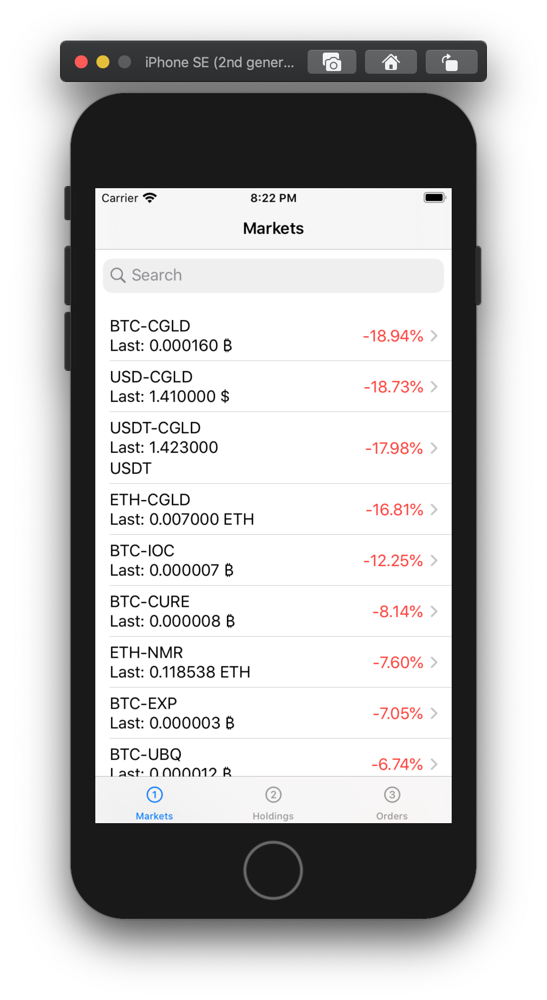

 
 
 
 

# Trexer

## Description
Trexer is a Bittrex Client on iOS using SwiftUI and Combine.

## Installation
This app only uses Cocoapods to install `cocoapods-keys` that is used to store `Bittrex` `api key` and `secret key` in the Keychain. There are no other external dependencies.

1) Install Cocoapods: `sudo gem install cocoapods`
2) Run in the terminal at the root of the folder: `pod install`
3) Enter your Bittrex API Key and Bittrex Secret Key
4) Open trexer.xcworkspace
5) Run

## Preview

